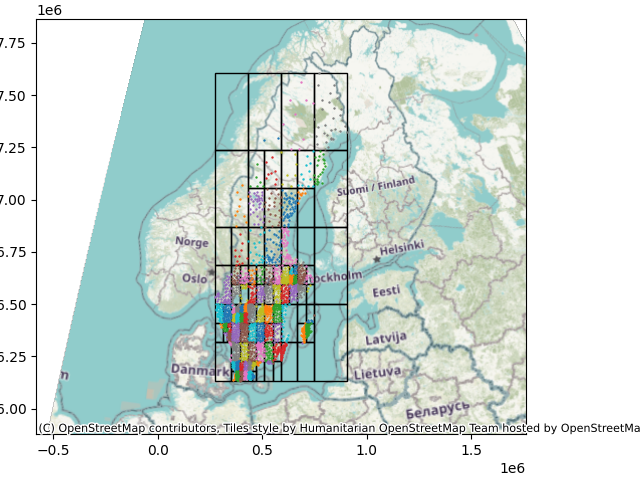

# Quadtree
Quadtree implementation : Cpp short project during my studies at KTH.
Folder ./utilities was given for the project.

# Instruction for compiling
g++ -std=c ++17 -Wall -o main main.cpp QuadTree.cpp
./main

Python file are automatically created during execution, they can be used to plot the results of the quadtree on a map of the sweden lakes (don't forget to uncomment last line in the python file to have a background) or for random points.

# Example of results
Here is an example of the results you could obtain for the sweden lakes map.

